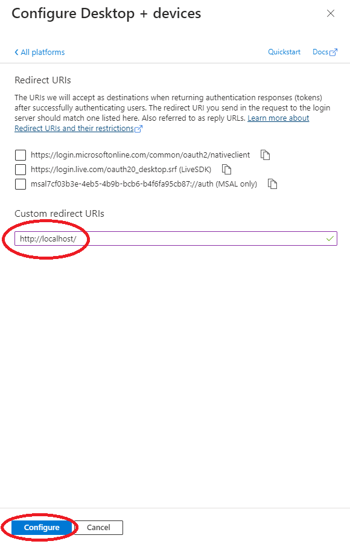
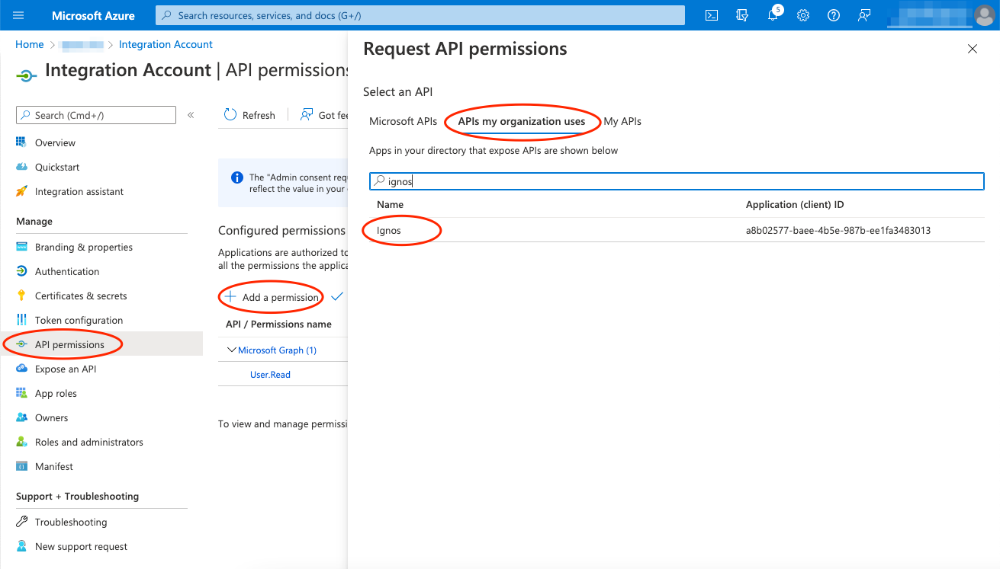

# Ignos Nc Transfer
Ignos Keep tool for file transfer from CAM programs to CNC machines

## Service principal
If you do not already have a suitable service principal in Microsoft Entra ID for allowing users to use the Ignos API, follow these instructions:

1. Sign in to the [Azure Portal](https://portal.azure.com) as an admin.
2. Search for and select **Azure Active Directory**.
3. Under **Manage**, select **App registrations > New registration**.
4. In the **Register an application** window, enter the app name, and then select **Register**.
   
5. Copy and make a note of the **Application (client) ID** and the **Directory (tenant) ID**. These values are required for authentication.
6. Under **Manage**, select **Authentication > Add a platform**. Add the **Mobile and desktop applications** 
   
7. Add `http://localhost/` as a **Custom Redirect URI** and select **Configure**.
   
8. Configure API permissions:
   - Select **API permissions**. The Microsoft Graph `User.Read` permission should already be selected.
   - Select **Add a permission** and in the next screen, under **APIs my organization uses**, find _Ignos_.
     
   - For **Delegated permissions**, select **api-access**.
   - Select **Add permissions**.
     
   - The API permissions should like this:
     
   - Optionally, select **Grant admin consent for...** to consent to these permissions on behalf of all users in your organisation and confirm that you want to make the new list of permissions active.


## Configuration

Configure the service principal information into `appsettings.json`:
```
"IgnosApi": {
        "TenantId": "",
        "ClientId": "",
        "Scope": "api://a8b02577-baee-4b5e-987b-ee1fa3483013/api-access",
        "BaseUrl": "https://api.ignos.io/"
    },
```

Leave the already configured items unchanged.
- In `TenantId`, configure your Microsoft Entra ID Tenant ID:


- Configure the service principal application (client) id in `ClientId`


## Usage
The tool is intended for use from other systems. It expects the path to the file to be transferred, and the Ignos Keep ID of the target machine as command line arguments.

```
NcTransfer.exe pathToFile machineId
```

## Logging

Configure logging in appsettings.json in the `Serilog` section. See [Serilog documentation](https://github.com/serilog/serilog-settings-configuration) for details.
In particular, adapt the `WriteTo` section to your needs:

```
        "WriteTo": [
            { "Name": "Console" },
            {
                "Name": "File",
                "Args": {
                    "path": "c:\\temp\\nctransfer-log.txt",
                    "rollingInterval": "Day",
                    "rollOnFileSizeLimit": true,
                    "retainedFileCountLimit": 10
                }
            }
        ],
```